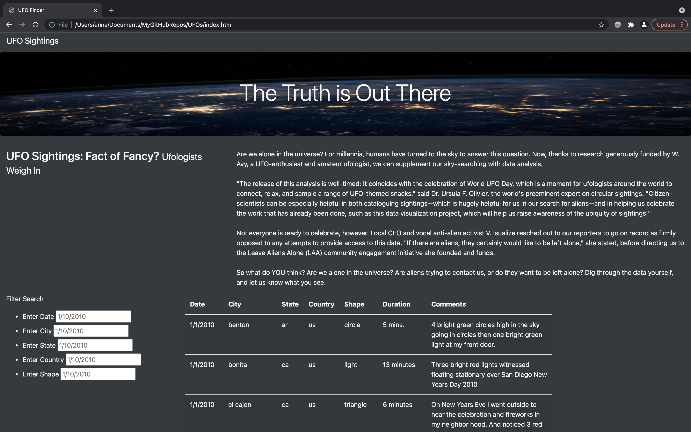

# **UFOs**
*Use JavaScript, HTML, and CSS to create a custome webpage that showcases UFO sighting data.

## Overview of Project:

#### *Purpose:*
This project allows users of to interact with the webpage and discover recorded data on UFO sightings. Additionally, the creatation of this webpage showcases the dynamic realtionship between the three coding languages, JavaScript, HTML, and CSS, used to build this site. 

## Results 

#### *How To Search:*
The layout of this webpage is simple, yet aestheticly pleasing for users to begin searching and filtering the UFO sighting data. Once the webpage is active, a quick scroll through the page will allow for the usere to gain an top level understanding of the project and the type of data that is filterable. The data table showcases all of the UFO sighting data ordered in chronological date order. 

While, manually searching through the table data is possible, it is not optimal. The "Filter Search" table on the left side of the webpage allows users to filter the table data utilizing five available filters: date, city, state, country, and/or shape.

## Summary:

- Refactor VBA code and measure performance
This deliverable will include an updated workbook and a folder with PNGs of the pop-ups with script run time.

Once the given files had been downloaded and named appropriately, the following septs were taken to perfomr the above necessary deliverables chronologically :

1. (Step 1a.)Create a tickerIndex variable and set it equal to zero before iterating over all the rows. You will use this tickerIndex to access the correct index across the four different arrays you’ll be using: the tickers array and the three output arrays you’ll create in Step 1b.

